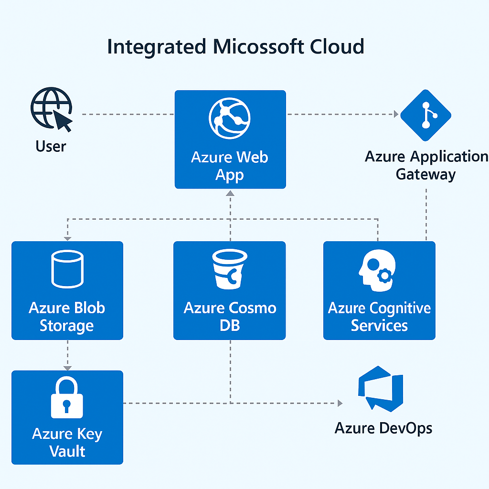
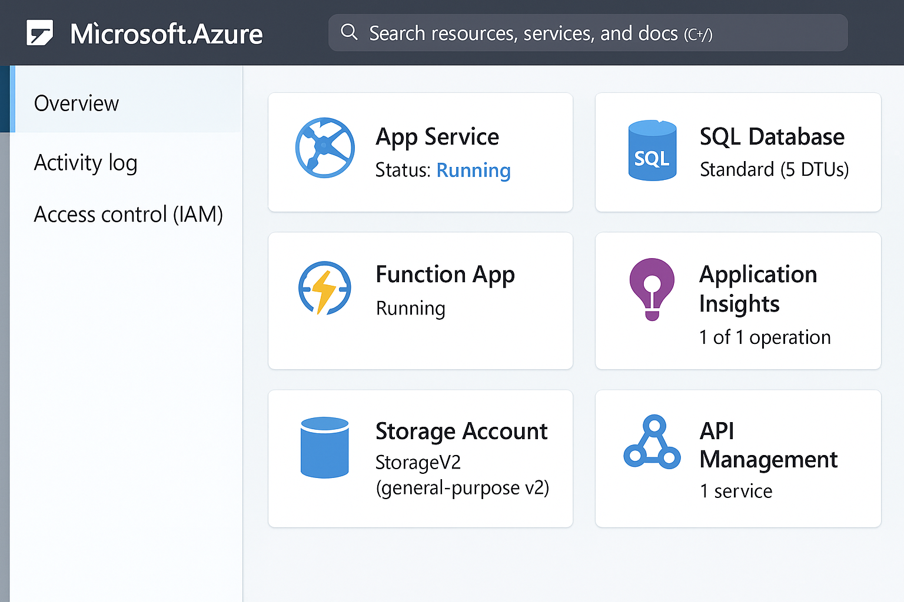

# Projeto Integrado Microsoft Cloud ☁️🔗

Este projeto simula uma aplicação corporativa moderna integrada com diversos serviços da nuvem Microsoft Azure. Criado como parte do desafio prático da DIO.

## 🧩 Arquitetura da Solução

## 🌐 Serviços Utilizados

- **Azure Web App**: Aplicação Web principal
- **Azure Application Gateway**: Balanceamento de carga e firewall de aplicação
- **Azure Cosmos DB**: Banco de dados NoSQL globalmente distribuído
- **Azure Blob Storage**: Armazenamento de arquivos e blobs
- **Azure Key Vault**: Gerenciamento de segredos e credenciais
- **Azure Cognitive Services**: Serviços de IA para análise e linguagem
- **Azure DevOps**: Pipeline de CI/CD integrado

## 🖼️ Print Simulado

Abaixo, uma simulação do painel da aplicação na plataforma Azure.

## 📘 Aprendizados

Durante a criação deste projeto, explorei:
- Interação entre múltiplos serviços da Azure
- Melhores práticas de segurança com Key Vault
- Integração de IA via Cognitive Services
- Monitoramento e controle de tráfego com Application Gateway

---

> Projeto entregue como parte do desafio **Microsoft Application Platform** na DIO.
