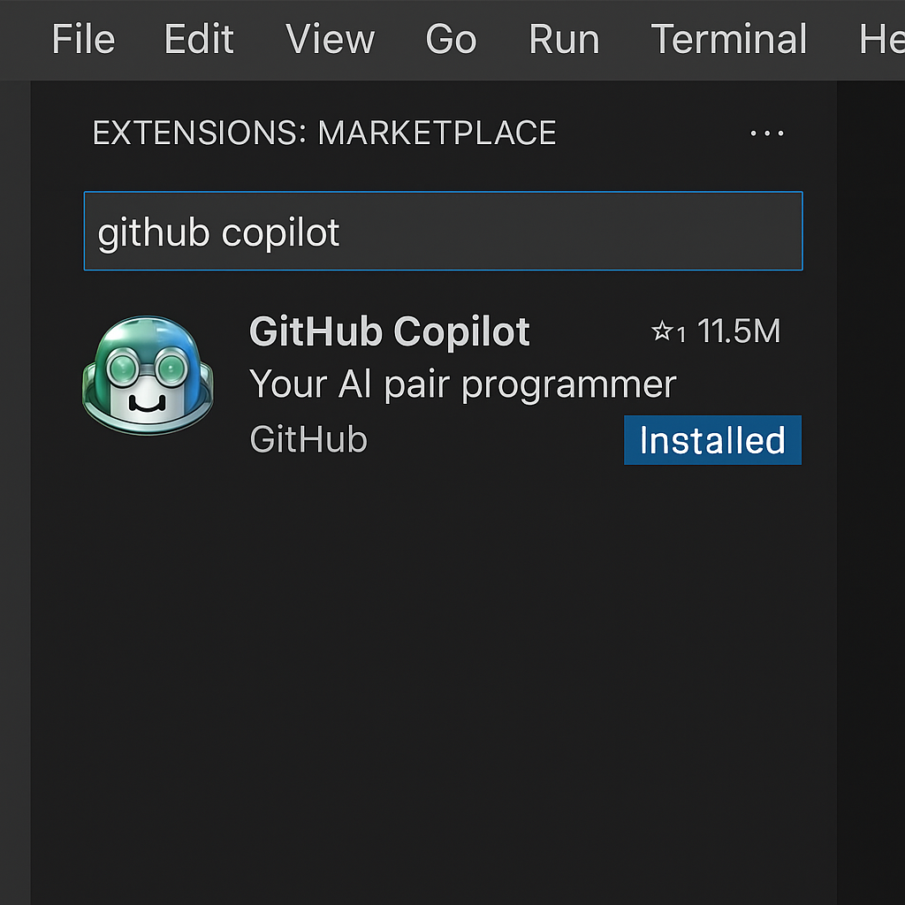

# Configurando o GitHub Copilot no Visual Studio Code 🤖💡

Este projeto demonstra como configurar e utilizar o GitHub Copilot no VS Code para acelerar o desenvolvimento com sugestões baseadas em IA.

## 🛠️ Etapas da Configuração

1. Instale a extensão "GitHub Copilot" via Marketplace.
2. Faça login com sua conta GitHub.
3. Confirme a autorização e integração com o Visual Studio Code.
4. Teste sugestões de código em arquivos `.js`, `.py`, `.java`, etc.

## ✨ Prints do Processo

### Instalação da extensão

### Autenticação com GitHub

### Sugestão automática de código

## 💡 Insights

- O Copilot acelera a prototipação de funções e algoritmos.
- Ele entende o contexto do código e faz sugestões inteligentes.
- É ideal para quem está estudando ou quer aumentar a produtividade com snippets automáticos.

---

> Projeto prático da DIO sobre o uso de IA para programação assistida com GitHub Copilot.
